# オープン・クローズ作業

## オープン作業

診療開始前に以下を行う。

### 顔認証リーダーの起動

1. 顔認証リーダーと接続しているノートPCを開く

> **ノートPCのパスワード**: `JPons@00369`（ロック画面が表示された場合に入力）

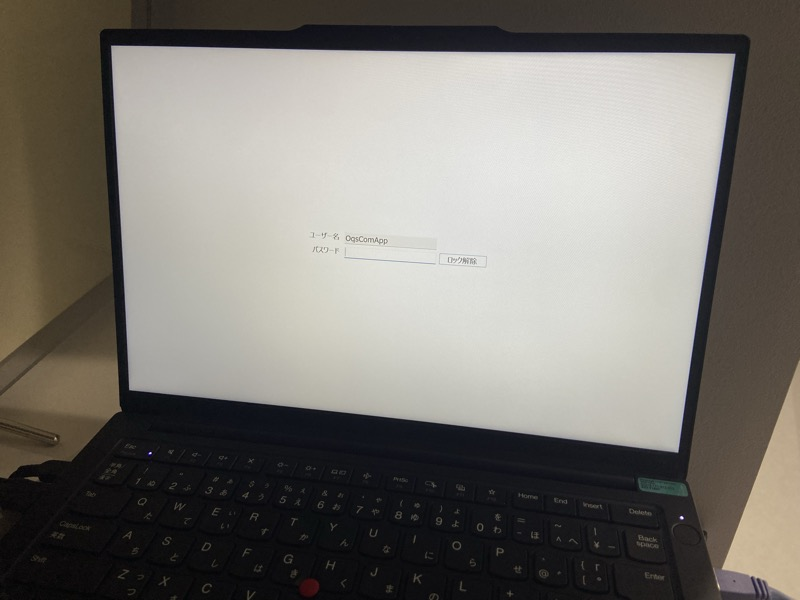

2. 「顔認証付きカードリーダアプリ」をダブルクリックする

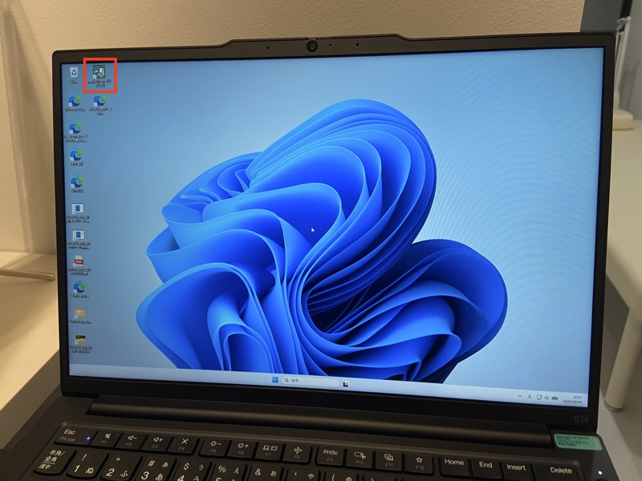

3. 顔認証付きカードリーダーアプリ管理画面が開くので、状態が「待機中」になるのを待つ
4. 「待機中」になれば起動完了

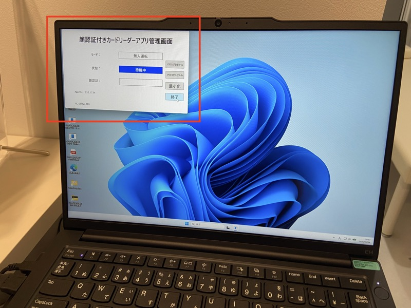

### 院内BGMの起動

~~受付PCのデスクトップにある「院内BGM」をダブルクリックする。~~

→ 院内BGMは診察室側のパソコンからかける形に変更しました。医師が操作するため、スタッフが操作する必要はありません。

<!-- 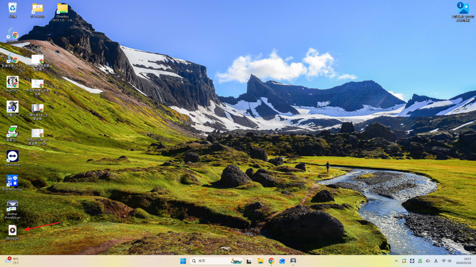 -->

### オンライン資格確認エージェントの起動

→ 運用が変わったため、この起動操作は不要となりました。

1. ~~受付PCのデスクトップにある「**procyon onshi-...**」アイコンをダブルクリックする~~

<!-- 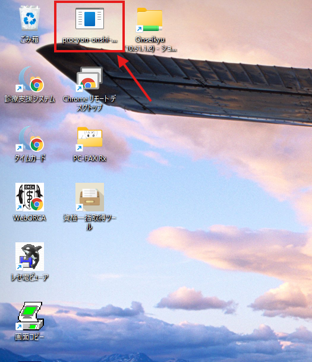 -->

2. ~~以下のような黒い画面が表示されれば完了~~

<!--  -->

> ~~**重要**: 黒い画面が表示されるだけでなく、**エラー表示が出ていないことを確認**してください。「顔認証結果XMLの監視を開始しました」と表示されていればOKです。~~

### 待合室テレビの起動

待合室のテレビでは、アレルゲン免疫療法・SAS/CPAPの患者さん向け動画をリプレイで流しています。

1. テレビをつける
2. 入力切替 → 「メディアプレーヤー」を選択
3. 「YUGATANAIKA」を選択
4. プレイリストを続きから再生

### 院内清掃・準備

1. 院内の掃除機がけ
2. 4階共用部の掃き掃除（10Lゴミ袋を持参し、塵取りで集めたゴミを回収する）
3. 入り口窓ガラスをウェットシートで拭く
4. 院内のライトを点灯する（下記参照）

#### ライト点灯箇所

以下の丸印のスイッチを点灯させる。**トイレも常時点灯**とする。

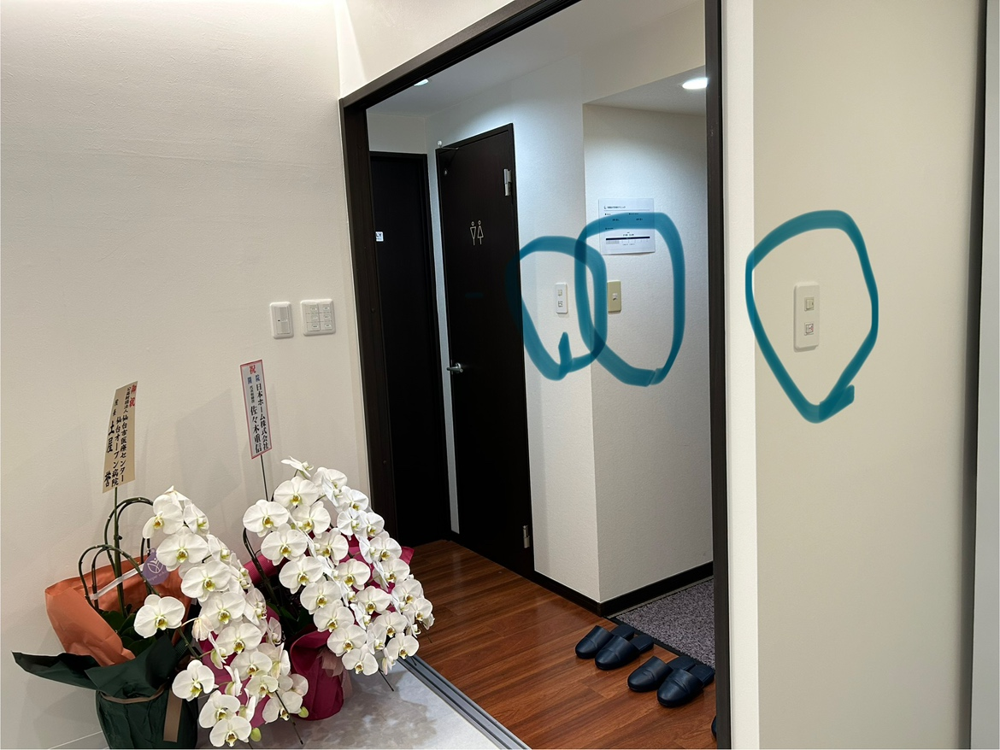
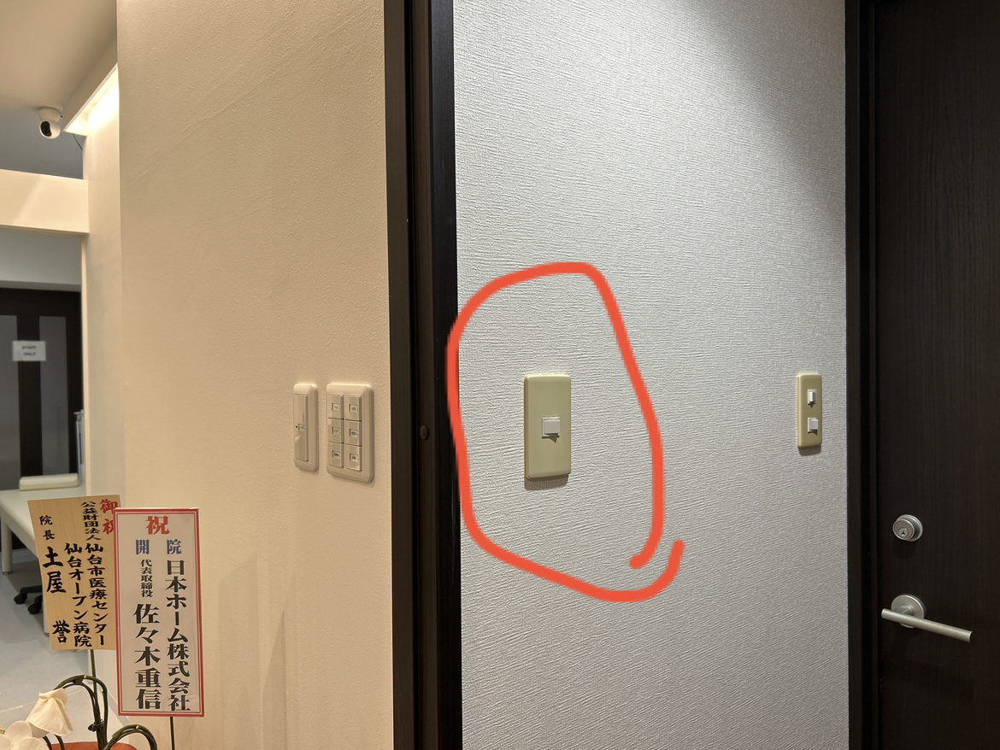

> **重要**: 院内スピーカーの電源も必ず入れる。電源が入ると「ピロリン」と音が鳴るので、鳴ることを確認する。

## クローズ作業

> **21時前までに以下を終了する**
>
> - 引き継ぎ項目は、翌日勤務者が出勤後に実施する

### 顔認証リーダーの終了

1. 顔認証リーダーと接続しているノートPCを開く
2. 「終了」をクリックする

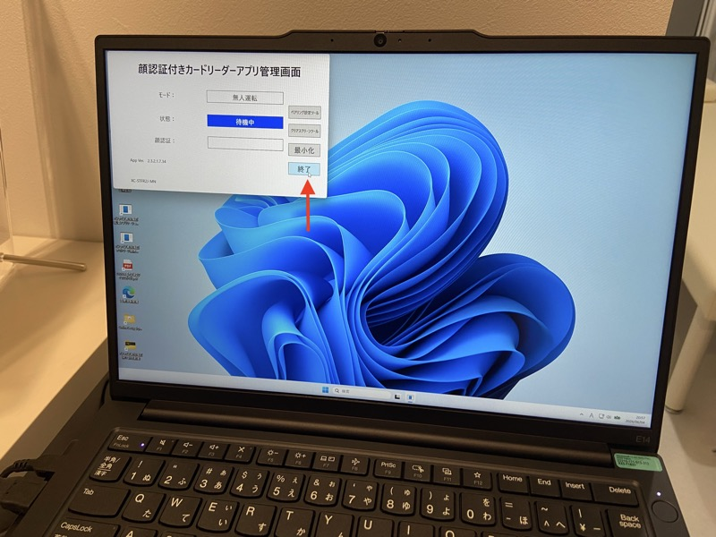

3. 「本当に終了しますか？」→「はい」をクリックする

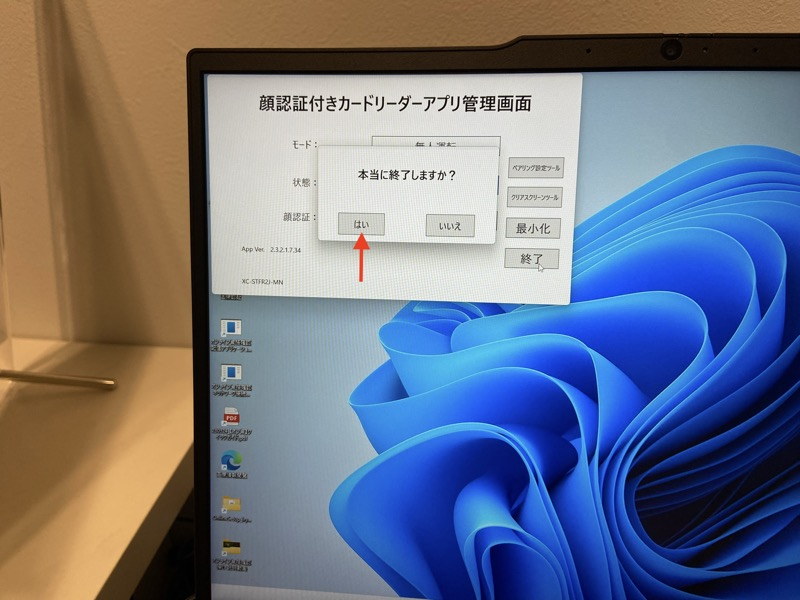

4. 顔認証付きカードリーダーアプリ管理画面の状態が「終了中」に切り替わり、そのまま待つと管理アプリ自体が閉じることを確認する

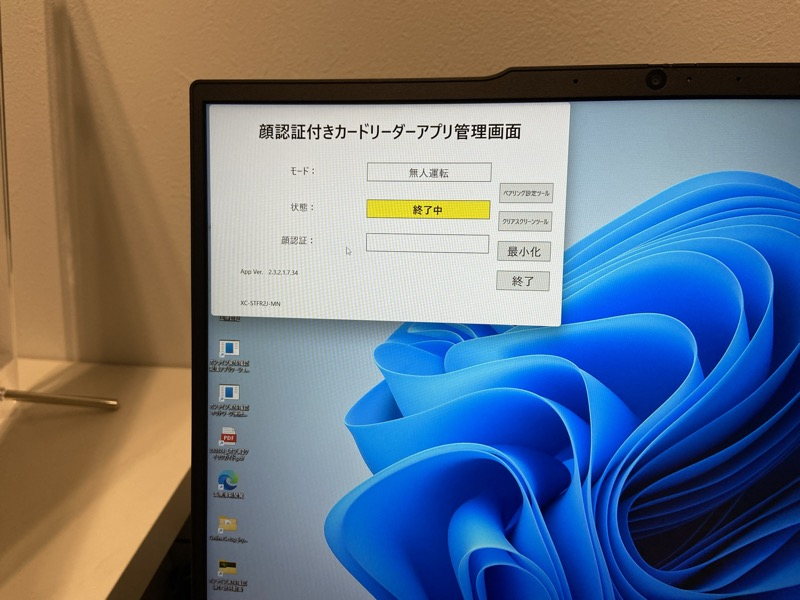

5. ノートPCはシャットダウンせずにそのまま画面を閉じて終了

### オンライン資格確認エージェントの終了

→ 運用が変わったため、この終了操作は不要となりました。

~~受付PCで起動している黒い画面（オンライン資格確認エージェント）の右上の「×」ボタンをクリックして閉じる。~~

<!-- 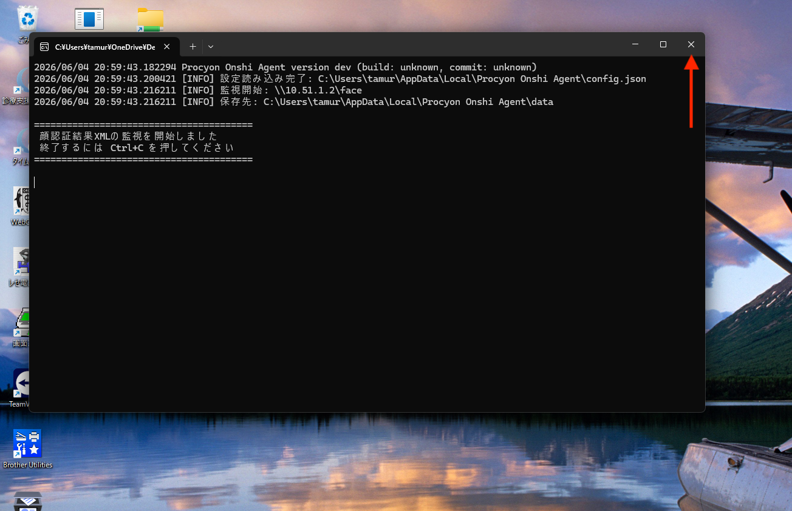 -->

### 院内BGMの終了

- ~~受付PCで再生中のBGMを停止し、ブラウザを閉じる~~
- → 院内BGMは診察室側のパソコンからかける形に変更しました。医師が操作するため、スタッフが操作する必要はありません。

### 待合室テレビの終了

- テレビの電源を切る

### 終業時の清掃・確認

1. 待合室・受付のモップがけ
2. トイレの最終清掃（21:00のチェック）
3. ゴミの回収・分別
4. 翌日の備品（ペーパータオル・消毒液等）の補充確認
5. 院内処方薬の在庫個数を記録する
