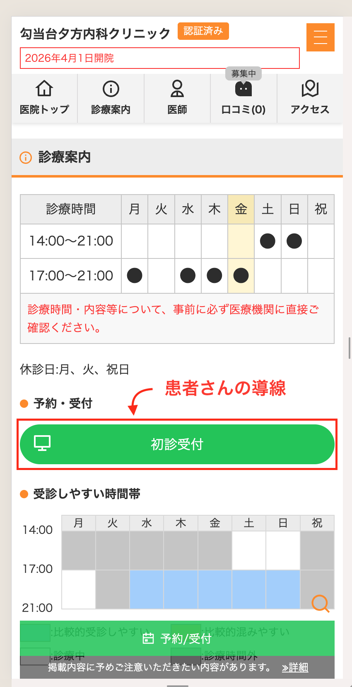
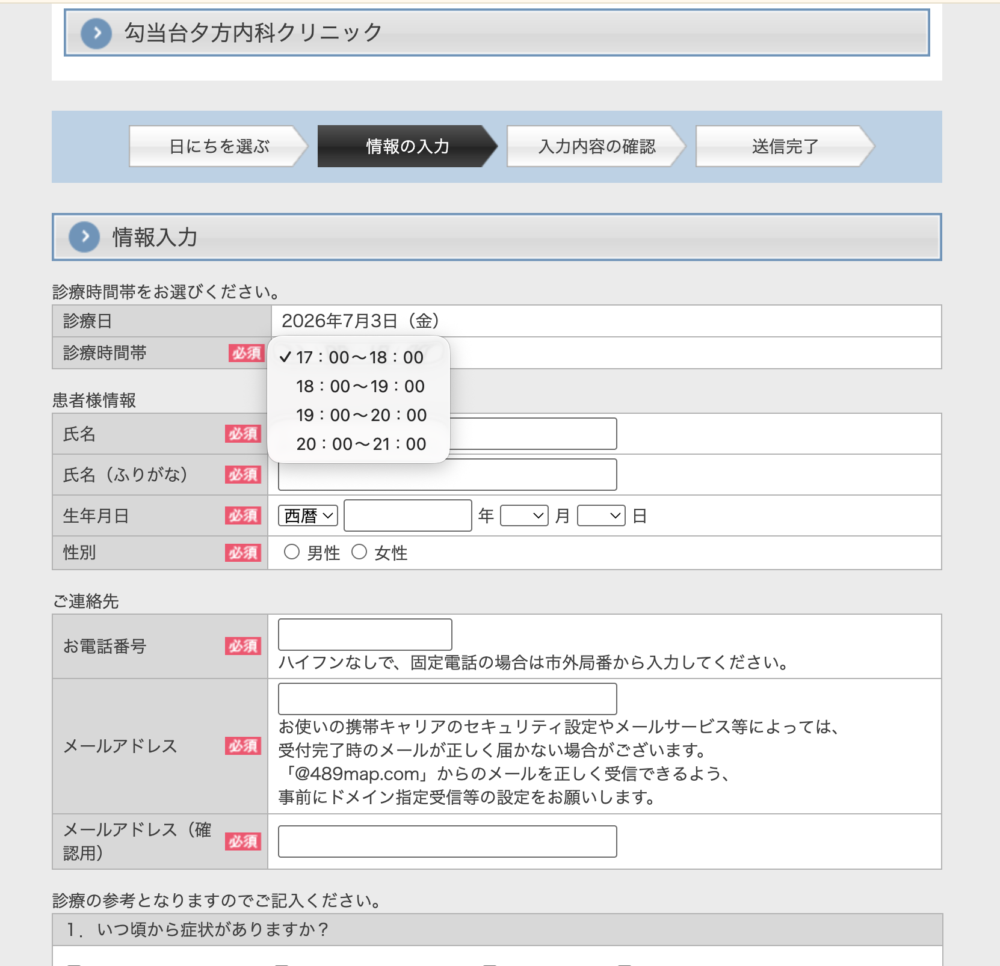
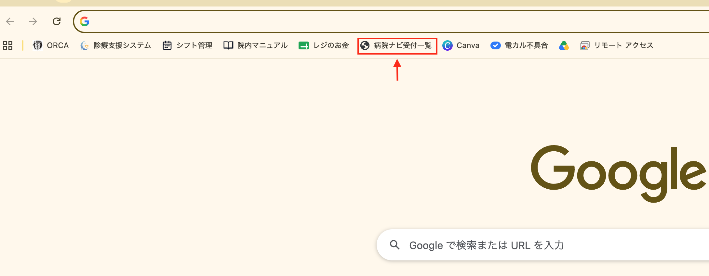
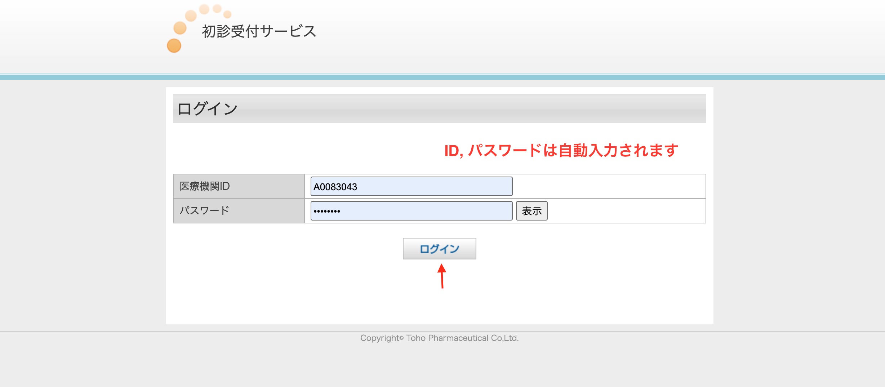
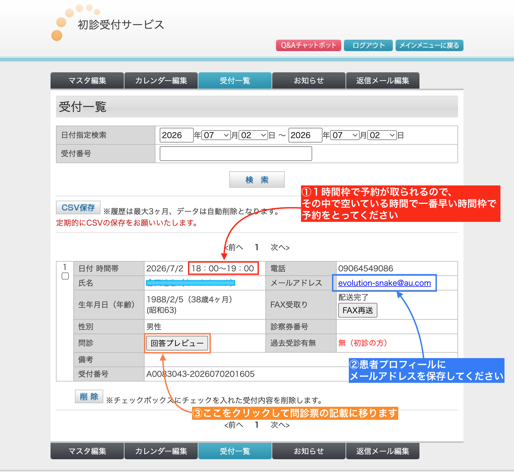
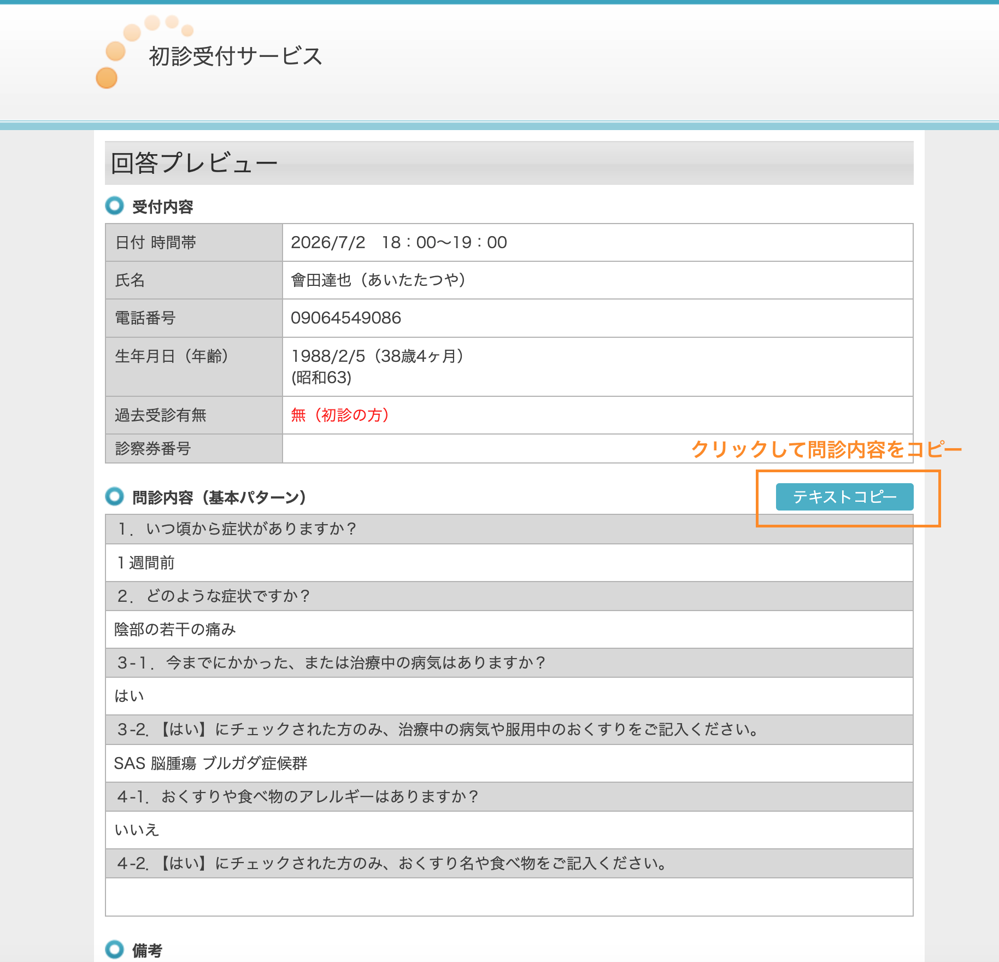
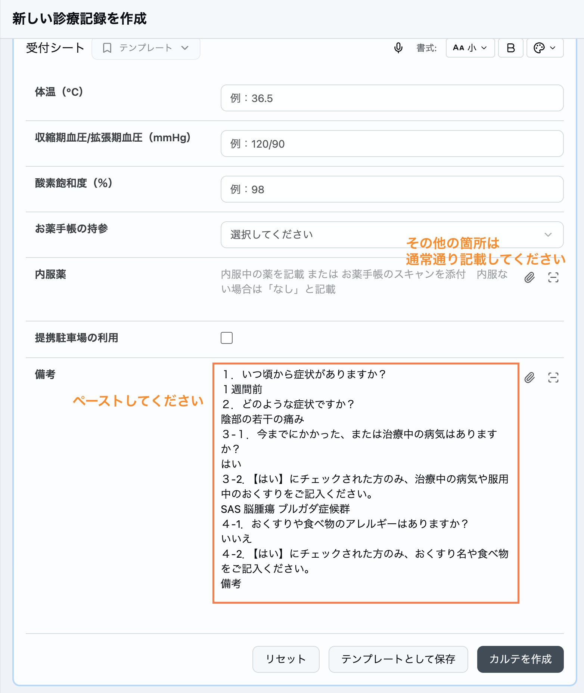
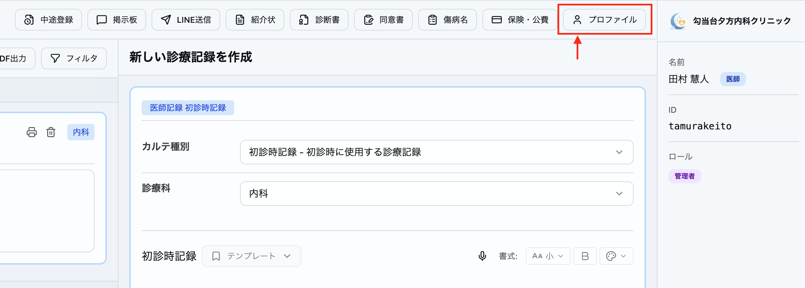
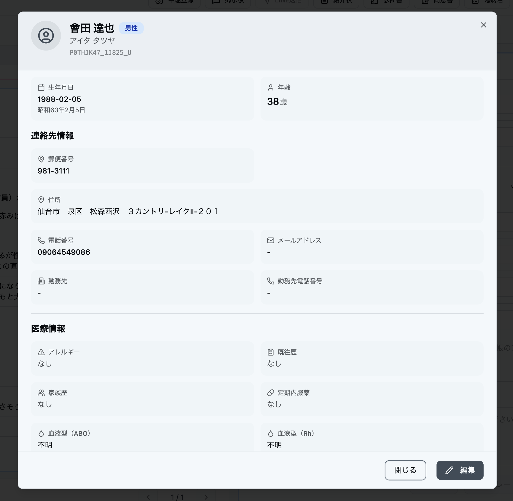

# 【病院なび】からの予約対応

> **2026年7月から**、病院なび（[医院ページ](https://byoinnavi.jp/clinic/321920)）への掲載が始まりました。これに伴い、病院なび経由での予約が入るようになっています。

## 概要

- 病院なびから予約が入ると、**FAXが届きます**
- 予約情報はブラウザのお気に入りバー「**病院ナビ受付一覧**」から確認する
- LINEからの予約と違い、**1時間単位**で予約が入る
- **メールアドレスが登録されている**ので、カルテの患者プロフィールに登録する

## 患者さんの導線

患者さんは病院なびの医院ページから「**初診受付**」ボタンで予約に進む。

予約は下図のように**1時間単位（17:00〜18:00 など）**で入る。何時何分という細かい指定はできない。

## 予約確認の流れ

### 1. 受付一覧を開く

Chromeのお気に入りバーの「**病院ナビ受付一覧**」から受付一覧を開く。

### 2. ログイン

ログイン画面が表示される。**医療機関IDとパスワードは自動入力される**ので、そのまま「ログイン」をクリックする。

### 3. 受付一覧で予約を確認する

「受付一覧」タブで予約内容を確認する。

> **① 予約時間について**: 1時間枠で予約が取られるので、**その枠の中で空いている一番早い時間**で受付操作（予約）を取ってください。

> **② メールアドレス**: 登録されているメールアドレスは、後述の手順で**患者プロフィールに保存**してください。

> **③ 問診内容**: 「回答プレビュー」をクリックすると問診票の記載に移れます。

> **CSV保存について**: 履歴は最大3ヶ月でデータは自動削除となります。定期的にCSVの保存をお願いします。

## 問診内容の転記

### 1. 回答プレビューを開く

受付一覧の「**回答プレビュー**」をクリックすると、問診内容が表示される。

「**テキストコピー**」ボタンで問診内容をまとめてコピーできる。

### 2. 受付カルテに貼り付ける

コピーした問診内容を、受付シートの**備考欄にそのままペースト**する。

- 「**病院なびからの予約**」と一言入れていただけるとわかりやすくて助かります
- その他の項目（体温・血圧など）は通常通り記載してください

## メールアドレスの登録

病院なびの予約にはメールアドレスが登録されているので、**カルテの患者プロフィールに登録**する。

### 1. プロファイルを開く

カルテ上部の「**プロファイル**」ボタンをクリックする。

### 2. メールアドレスを保存する

プロフィール画面右下の「**編集**」から、受付一覧に表示されているメールアドレスを登録する。

