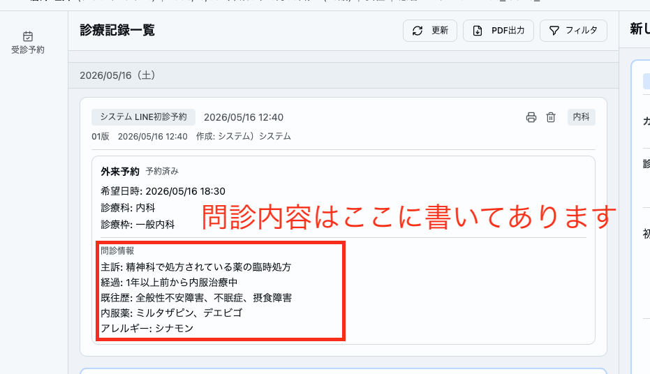

# 受付対応

> **重要**: 受付対応はクリニックを代表するものです。わからないことは憶測で回答せず、必ず確認してから正確な情報をお伝えしてください。

## 来院時の流れ

> 詳しいシステムの操作は[電子カルテ・レセコン操作マニュアル](https://www.notion.so/3356e8ba85c58016818ed588fda40651)で確認してください。

### 予約ありの患者

1. 受付一覧で予約を確認し、受付操作を行う
2. **車で来院したか確認する**
3. 保険証（またはマイナ保険証）を受け取り、資格確認を行う
4. **内服薬の確認**を行う（お薬手帳があればスキャンしてカルテに添付する）
5. **体温測定**を行う
6. アセスメントの上で必要であれば**血圧測定**を行う（既往、鑑別、全身状態、中年以上、肥満 等から判断）
7. 患者は医師が診察室に案内する

> 受付で血圧を測っていなくても、診察の上で必要があれば改めて診察室で測定するので大丈夫です。

### アフターピル（緊急避妊薬）の患者

> **重要**: アフターピルは**性交後72時間以内**の服用が必要で、早いほど効果が高いです。**最優先で対応**してください。

1. **顔写真付き身分証**を確認する
2. 体温測定・問診・保険確認は不要（診察室で医師が行う）
3. **すぐに診察室に案内する**
4. 看護師に「アフターピルの患者さんです」と伝える（薬と水の準備のため）

### 予約なしの患者（ウォークイン）

> **重要**: 予約優先のため、待ち時間が発生する可能性があることを必ずお伝えする。期待値を事前に調整することで、クレーム予防につながります。

1. **当日枠で予約を立てて受付操作を行う**
2. **車で来院したか確認する**
3. 口頭で簡単に問診を行いカルテに記載する（現病歴、既往歴、内服 程度でOK）
4. 保険証（またはマイナ保険証）を受け取り、資格確認を行う
5. **内服薬の確認**を行う（お薬手帳があればスキャンしてカルテに添付する）
6. **体温測定**を行う
7. 必要に応じて**血圧測定**を行う
8. 患者は医師が診察室に案内する

## 問診について

> **患者さんの待ち時間を最小化するために**、状況に応じて問診の取り方を調整してください。

- LINEや電話で既に問診を頂いている場合は、**同じ内容を重複して聞かないこと**
- 必ずカルテを確認してから問診を取る

> 例えば「内服：なし」と回答いただいている患者さんに対して、「内服しているお薬はありませんね？」と確認する聞き方であれば問題ない。ただし、内服薬を詳細に回答したにも関わらず受付で同じ質問をされると、「せっかく問診票書いたのに見てないのかな」と不快に感じられることも少なくない。

### LINE問診の確認方法

カルテの診療記録一覧で、予約情報の下に「問診情報」として表示されている。

### LINEメッセージ送信機能

電子カルテから患者さんのLINEに直接メッセージを送信する機能がある。

- 問診の確認と同様に、**事前にこちら側からどんなメッセージを送っていたか**も確認してから問診を取る
- この機能で送信したメッセージは**取り消し操作ができない**
- 患者さんにメッセージを送信する際は、**必ず院長に確認を取ってから**行う

### 医師が手すきの場合

- 医師が手すきの場合は、問診を詳しく取らなくてよい
- **主訴と内服薬の確認だけ**で大丈夫です
- 詳細な問診は医師が診察時に行います

## 内服薬の確認

お薬手帳がある場合は、以下の範囲をスキャンしてカルテに添付する。

- **直近から見開き4ページ程度**は必ずスキャンする
- 処方日数を確認し、**現在も内服中のページ**は必ずスキャンする
- **直近1ヶ月以内の処方**は必ずスキャンする

## 保険証の確認

| 確認項目       | 内容             |
| -------------- | ---------------- |
| 有効期限       | 期限切れでないか |
| 氏名・生年月日 | 本人のものか     |
| 負担割合       | 1割・2割・3割    |

### マイナ保険証の場合

> **重要**: 顔認証リーダーによるマイナ保険証の導入は**5月下旬の予定**です。それまでの間、保険証の各番号の確認が必要となります。

> **スタッフの皆様へ**: マイナ保険証リーダーの導入はすでに一般的なものであり、マイナ保険証などから保険番号の確認を強いる作業は、**患者さんに大変な負担をかけるものです**。くれぐれも申し訳ないという意識を忘れず、丁寧な対応を心がけてください。

#### ホームページでのご案内

当院ホームページでマイナ保険証に関する案内を掲載しています。スタッフも必ず以下のページを確認してください。

**[マイナ保険証について（当院HP）](https://koutoudai-yugata-naika.clinic/#insurance)**

#### トークスクリプト

マイナ保険証をお持ちの患者さんには、以下のようにご案内してください。

---

「大変申し訳ございません。当院では顔認証リーダーの導入が5月下旬の予定となっておりまして、それまでの間、保険証の番号を確認させていただく必要がございます。

**資格確認証**をお持ちでしたらそちらをご提示いただくか、または**マイナポータル**から保険証の情報を確認させていただけますでしょうか。

マイナポータルのアプリはお持ちですか？

（持っていない場合）
大変お手数ですが、マイナポータルのアプリのインストールをお願いできますでしょうか。

（アプリがある場合）
ありがとうございます。マイナポータルにログインしていただき、健康保険証のページを開いていただけますでしょうか。」

---

#### 操作のサポート

- マイナポータルの操作はやや煩雑です
- もしよければ、**患者様側に立って一緒に操作を手伝ってあげてください**
- 焦らせず、丁寧にサポートすることを心がけましょう

## 公費の確認

公費がある場合は、**必ずスキャンしてカルテに添付する**。

### レセコンへの登録

- **保険＋公費の保険組み合わせ番号**が登録されている状態にする
- 公費の登録を行わずに医師が会計登録まで進めてしまうと、修正に手数がかかる
- **診察前に公費の登録が済んでいない場合は、必ず医師に共有する**

## クレーム対応

### 基本姿勢

1. まず落ち着いて**傾聴する**（途中で遮らない）
2. 「ご不便をおかけして申し訳ございません」とお詫びする
3. 状況を正確に把握する

### 対応フロー

- **待ち時間への不満** → 現在の混雑状況と目安の待ち時間をお伝えする。改善が難しい場合はお詫びし、院長へ報告する
- **対人トラブル** → 当事者を引き離し、双方の話を別々に聞く。速やかに院長へ報告する
- **判断に迷う場合** → その場で無理に解決しようとせず、院長へ相談する

> クレーム内容は必ずカルテに残し、院長へ報告してください。

## 患者さん向け資料

患者さんからの問い合わせに対応できるよう、以下の資料を受付用に準備している。**デスク引き出し3段目のマニュアルファイル**に入っているので、時間がある時に確認しておくこと。

- **アレルゲン免疫療法**（シダキュア・ミティキュア）
- **アフターピル**（緊急避妊薬）

### アレルゲン免疫療法の動画

患者さん用の動画をGoogle Driveに上げている。**全3本**あるので、勤務中お手隙の際に視聴しておくこと。

- Chromeのお気に入りバーの「**アレルゲン免疫療法**」からフォルダを開ける

## その他

- **受付はなるべく離れない**
- **受付を離れる際には必ず離席札を立てる**
- 医師に確認事項があるときは**極力内線を使用する**（受付を離れる必要がなくなる）
- 院長の年齢を聞いてくる患者さんが時折いらっしゃいます。教えないでください。
- 次回受診時の共有事項やリマインドがある場合は、**患者カルテの掲示板に記載する**
