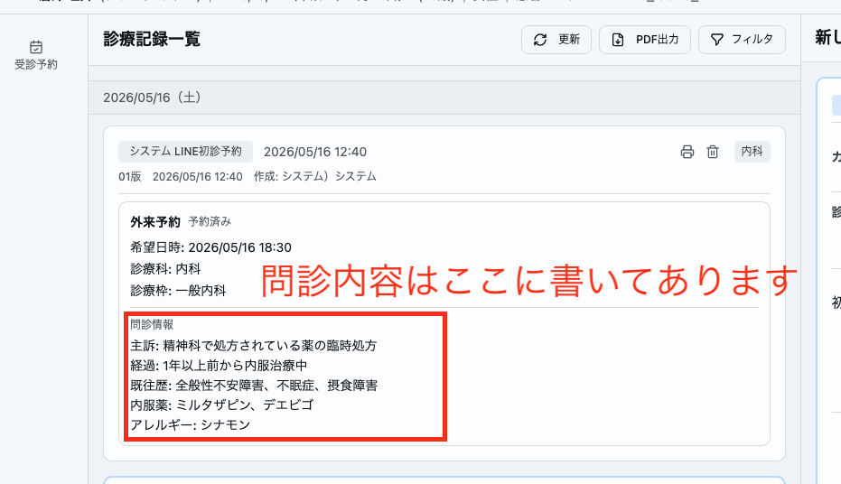
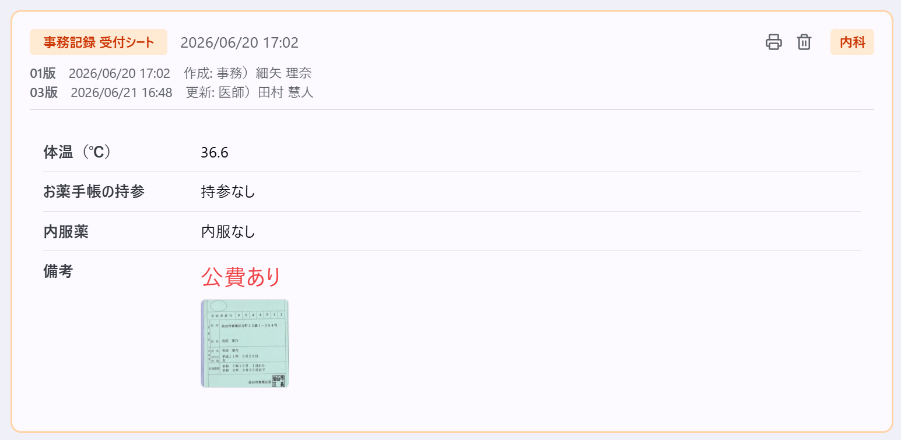

# 受付対応

> **重要**: 受付対応はクリニックを代表するものです。わからないことは憶測で回答せず、必ず確認してから正確な情報をお伝えしてください。

## 来院時の流れ

> 詳しいシステムの操作は[電子カルテ・レセコン操作マニュアル](https://www.notion.so/3356e8ba85c58016818ed588fda40651)で確認してください。

### 予約ありの患者

1. 受付一覧で予約を確認し、受付操作を行う
2. **車で来院したか確認する**
3. **マイナ保険証または資格確認書**を受け取り、資格確認を行う（下記「資格確認（保険証の確認）」を参照）
4. **内服薬の確認**を行う（お薬手帳があればスキャンしてカルテに添付する）
5. **体温測定**を行う
6. 要件に該当する場合は**血圧測定**を行う（下記「血圧測定」を参照）
7. 患者は医師が診察室に案内する

### アフターピル（緊急避妊薬）の患者

> **重要**: アフターピルは**性交後72時間以内**の服用が必要で、早いほど効果が高いです。**最優先で対応**してください。

1. **顔写真付き身分証**を確認する
2. 体温測定・問診・保険確認は不要（診察室で医師が行う）
3. **すぐに診察室に案内する**
4. 看護師に「アフターピルの患者さんです」と伝える（薬と水の準備のため）

### 予約なしの患者（ウォークイン）

> **重要**: 当院は**予約制**です（2026年9月〜）。予約なしでも受け付けるが、予約の方が優先になるため**お待ちいただく可能性がある**ことを必ずお伝えする。期待値を事前に調整することで、クレーム予防につながります。次回からはLINEまたは電話で予約していただくようご案内する。
>
> HPでも「予約なしでも来院できるが、予約優先のためお待ちいただくことがある」と案内している。

1. **当日枠で予約を立てて受付操作を行う**（予約枠には入れない）
2. **車で来院したか確認する**
3. 口頭で簡単に問診を行いカルテに記載する（現病歴、既往歴、内服 程度でOK）
4. **マイナ保険証または資格確認書**を受け取り、資格確認を行う（下記「資格確認（保険証の確認）」を参照）
5. **内服薬の確認**を行う（お薬手帳があればスキャンしてカルテに添付する）
6. **体温測定**を行う
7. 要件に該当する場合は**血圧測定**を行う（下記「血圧測定」を参照）
8. 患者は医師が診察室に案内する

> **診察順について**: 予約の患者さんが予約時間を過ぎている、または過ぎる見込みの場合は、予約の患者さんを優先して診察する（この判断は院長が受付一覧の予約時間を見て行う）。そのため、受付時に患者さんへ「**すでにご予約いただいている患者さんが優先になりますので、◯時◯分頃のご案内予定になります**」と一言お伝えする。

## 問診について

> **患者さんの待ち時間を最小化するために**、状況に応じて問診の取り方を調整してください。

- LINEや電話で既に問診を頂いている場合は、**同じ内容を重複して聞かないこと**
- 必ずカルテを確認してから問診を取る

> 例えば「内服：なし」と回答いただいている患者さんに対して、「内服しているお薬はありませんね？」と確認する聞き方であれば問題ない。ただし、内服薬を詳細に回答したにも関わらず受付で同じ質問をされると、「せっかく問診票書いたのに見てないのかな」と不快に感じられることも少なくない。

### LINE問診の確認方法

カルテの診療記録一覧で、予約情報の下に「問診情報」として表示されている。

### LINEメッセージ送信機能

電子カルテから患者さんのLINEに直接メッセージを送信する機能がある。

- 問診の確認と同様に、**事前にこちら側からどんなメッセージを送っていたか**も確認してから問診を取る
- この機能で送信したメッセージは**取り消し操作ができない**
- 患者さんにメッセージを送信する際は、**必ず院長に確認を取ってから**行う

### 医師が手すきの場合

- 医師が手すきの場合は、問診を詳しく取らなくてよい
- **主訴と内服薬の確認だけ**で大丈夫です
- 詳細な問診は医師が診察時に行います

## 内服薬の確認

お薬手帳がある場合は、以下の範囲をスキャンしてカルテに添付する。

- **直近から見開き4ページ程度**は必ずスキャンする
- 処方日数を確認し、**現在も内服中のページ**は必ずスキャンする
- **直近1ヶ月以内の処方**は必ずスキャンする

> スキャン後はその場で患者さんにお返しせず、**診察前に医師へお渡しください**。医師が手元で確認し、診察時に直接患者さんへお返しします。

## 血圧測定

以下のいずれかに該当する場合は、**必須で血圧測定**を行う。

- **40歳以上**
- **高血圧・糖尿病・高脂血症などの慢性疾患がある**
- **頭痛・めまいの症状がある**
- **ピルを内服していて、かつ咽頭痛がある**

> 受付で血圧を測っていなくても、診察の上で必要があれば改めて診察室で測定するので大丈夫です。

## 資格確認（保険証の確認）

> **重要**: 従来の健康保険証は**2025年12月1日で有効期限が終了**し、期限切れの保険証を受け付ける経過措置も**2026年7月31日で終了**しました。**従来の健康保険証は使えません。**

### 患者さんにお持ちいただくもの

| 患者さんの状況             | お持ちいただくもの                                       |
| -------------------------- | -------------------------------------------------------- |
| マイナ保険証をお持ちの方   | **マイナ保険証**（健康保険証利用登録をしたマイナンバーカード） |
| マイナ保険証をお持ちでない方 | **資格確認書**（加入している保険者から交付される）       |

- スマートフォンのマイナ保険証も利用できる（実物のカードの提示は不要）
- 従来の健康保険証を持参された場合 → **使用できない**旨をお伝えし、保険者へ資格確認書の交付を確認いただくようご案内する

### 確認項目

| 確認項目       | 内容             |
| -------------- | ---------------- |
| 有効期限       | 期限切れでないか |
| 氏名・生年月日 | 本人のものか     |
| 負担割合       | 1割・2割・3割    |

> **重要**: マイナ保険証ではない場合（資格確認書）は、**必ずスキャンしてカルテに添付**してください。

### マイナ保険証の場合

> → 顔認証リーダーが導入されたため、以前の運用（保険証番号の手動確認・マイナポータルでの確認）は不要となりました。

### 保険が有効になる組み合わせ

停電・カードリーダーの故障・ネットワーク障害・ICチップの破損などで**オンライン資格確認ができない場合**は、以下のいずれかで資格確認を行う。

| 患者さんがお持ちのもの                                 | 保険資格の確認 |
| ------------------------------------------------------ | -------------- |
| マイナ保険証（カードリーダーで確認できる）             | ✅ 可          |
| 資格確認書                                             | ✅ 可          |
| マイナンバーカード ＋ マイナポータルの資格情報画面（PDF可） | ✅ 可          |
| マイナンバーカード ＋ **紙の**「資格情報のお知らせ」   | ✅ 可          |
| 上記のいずれも無い場合 → **被保険者資格申立書**に記入いただく | ✅ 可          |
| 「資格情報のお知らせ」**のみ**（カードなし）           | ❌ 不可        |
| 「資格情報のお知らせ」の**スマホ画面・データ**         | ❌ 不可（紙のみ有効） |
| 従来の健康保険証                                       | ❌ 不可        |

> スマートフォンでその場でマイナポータルにログインし、資格情報の画面を提示いただく場合は、実物のマイナンバーカードの提示は不要です。

### マイナンバーカードの電子証明書の有効期限

> カード本体の有効期限は10年（未成年は5年）ですが、**中に入っている電子証明書は5年**です。ここが切れるとマイナ保険証として使えなくなります。

- 有効期限の**3ヶ月前〜3ヶ月後**は、顔認証リーダーに**更新アラート**が表示される
- **有効期限が切れてから3ヶ月間は健康保険証として利用可能**。その間にお住まいの市区町村窓口で更新いただくようご案内する
- 3ヶ月を過ぎると資格確認ができないため、資格確認書等での受診が必要になる

> 出典: 厚生労働省「資格確認方法について」 https://www.mhlw.go.jp/stf/newpage_50657.html （2026年9月19日確認）

## 公費の確認

公費がある場合は、以下の対応を行う。

1. 公費に関する書類を患者さんからお預かりし、スキャンしてカルテに添付する
2. カルテに**赤文字・大文字で「公費あり」と記載**する
3. お預かりした書類を医師に手渡す

> 公費の登録は医師が診察室側で行い、診察時に直接患者さんへ書類をお返しします。

> 公費は診察前に医師が登録しておく必要があるため、診察を始める前に公費併用であることが医師に伝わっていると助かります。

## クレーム対応

### 基本姿勢

1. まず落ち着いて**傾聴する**（途中で遮らない）
2. 「ご不便をおかけして申し訳ございません」とお詫びする
3. 状況を正確に把握する

### 対応フロー

- **待ち時間への不満** → 現在の混雑状況と目安の待ち時間をお伝えする。改善が難しい場合はお詫びし、院長へ報告する
- **対人トラブル** → 当事者を引き離し、双方の話を別々に聞く。速やかに院長へ報告する
- **判断に迷う場合** → その場で無理に解決しようとせず、院長へ相談する

> クレーム内容は必ずカルテに残し、院長へ報告してください。

## 患者さん向け資料

患者さんからの問い合わせに対応できるよう、以下の資料を受付用に準備している。**デスク引き出し3段目のマニュアルファイル**に入っているので、時間がある時に確認しておくこと。

- **アレルゲン免疫療法**（シダキュア・ミティキュア）
- **アフターピル**（緊急避妊薬）

### アレルゲン免疫療法の動画

患者さん用の動画をGoogle Driveに上げている。**全3本**あるので、勤務中お手隙の際に視聴しておくこと。

- Chromeのお気に入りバーの「**アレルゲン免疫療法**」からフォルダを開ける

## その他

- **受付はなるべく離れない**
- **受付を離れる際には必ず離席札を立てる**
- 医師に確認事項があるときは**極力内線を使用する**（受付を離れる必要がなくなる）
- 院長の年齢を聞いてくる患者さんが時折いらっしゃいます。教えないでください。
- 次回受診時の共有事項やリマインドがある場合は、**患者カルテの掲示板に記載する**
