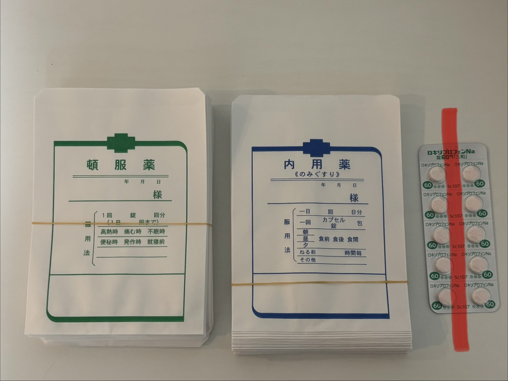

# 院内処方

> 当院は薬剤師のいない自家調剤のため、薬の管理でミスが発生しやすい状況にある。過去に入力ミスにより患者さんへ過剰請求してしまう事例が発生しており、個人の注意だけでなく**システムとしてミスを防ぐ**ためのオペレーションを徹底する。

## オペレーションフロー

院内処方の場合、以下の順番で対応する。

```
診察 → お薬お渡し → 会計
```

### 手順

1. 診察終了後、患者さんは**待合でお待ちいただく**
2. 医師が診察室側のレセコンで**お薬情報とお薬手帳を印刷**する（受付側プリンターから出力）
3. 看護師は印刷を確認し、**お薬の準備**を行う
4. **医師・看護師でダブルチェック**を行う
5. 患者さんへお薬をお渡しする
6. その後、会計に進んでいただく

> **お薬手帳のお渡しは会計時に受付から行う**（詳細は[会計業務](./03-billing.html)を参照）。

> 院内処方の場合、会計処理を行っても薬情と手帳は印刷されず、明細書のみ印刷される設定になっている。

## ダブルチェックの徹底

ミスのない状態とは、以下の3つが全て一致していることである。

1. **医師が行おうとした処方内容**
2. **レセコンに登録されている薬の内容**
3. **実際にお渡しする薬の内容**

レセコンから印刷されたお薬情報と、実際に用意した薬を**目視でダブルチェック**することでミスを防ぐ。

> **重要**: どんなに待合が立て込んでいる場合でも、**ダブルチェックは絶対に省略しない**こと。

## 違和感があれば報告

看護師・事務スタッフは、医師の処方内容に少しでもミスや違和感（量が多い？いつもと違う？など）を感じた場合、**なるべく早い段階で医師に確認**すること。

小さなミスがクレームや重大な医療事故に繋がる可能性がある。

## 薬の在庫管理

管理運用コストを減らすためにも、**端数の薬が在庫に残らないよう**運用する。

- **開封済みの処方薬から使う**
- 新たに箱を開封した場合は、**期限チェックシートの期限を更新する**
- 開封済みの薬がある状態で別の箱を開封すると期限が混在するため、**必ず確認を行う**

## 薬袋と調剤



1. 薬袋は**一剤につき一枚**使用し、薬剤名を記入する
2. 薬はワンシート10錠になっており、基本は**半端が出ないよう処方**する
3. 5錠の場合は写真のように**縦にカット**する
