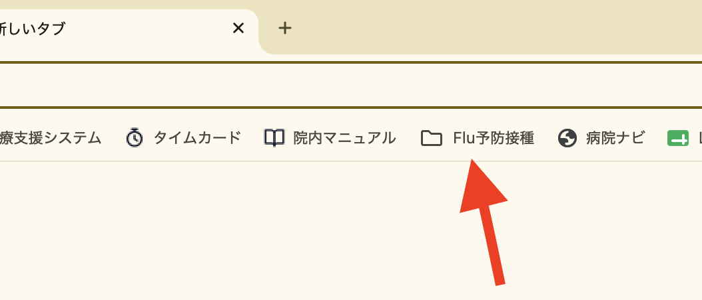
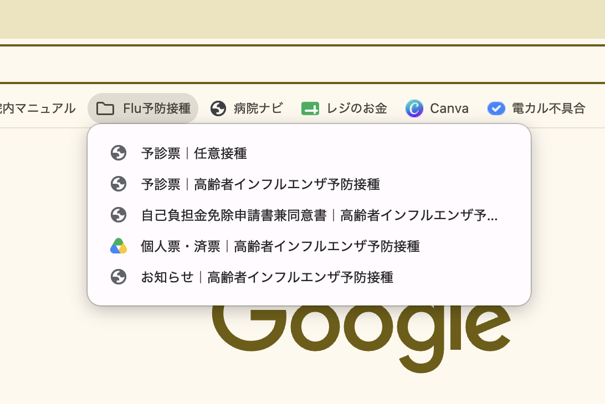

# インフルエンザ予防接種

インフルエンザ予防接種には**任意接種**（13歳以上・3,300円）と**定期接種**（65歳以上・自己負担1,500円）の2種類がある。使用する予診票・書類・会計が異なるので注意する。

## 予診票の印刷

Chromeブックマークバーの「Flu予防接種」フォルダに各書類のリンクがある。

  
  

| 接種の種類 | 予診票 | ブックマーク名 |
|---|---|---|
| 任意接種 | 当院の様式（HP掲載） | 予診票｜任意接種 |
| 定期接種 | 仙台市の様式（市HP PDF） | 予診票｜高齢者インフルエンザ予防接種 |

- 予診票は事前に複数枚印刷してストックしておく
- 患者が自分で印刷して持参する場合もある（どちらの様式も可）

## 任意接種の流れ

対象: 13歳〜64歳の方（65歳以上でも仙台市に住民票がない方はこちら）

### 受付

1. 受付で**体温測定**を行う
2. **任意接種の予診票**を渡し、記入してもらう
3. 書き終わったら受付に渡してもらう

### 看護師の準備

受付から予診票を受け取ったら、以下を**ビニールをかけた膿盆**に入れて診察室に持っていく。

- ワクチン（吸って**27G針**を装着した状態）
- アルコール綿
- 絆創膏
- 予診票

### 診察室（医師）

1. 予診票を確認し、診察・問診を行う
2. ワクチンを接種する（上腕に皮下注射、0.5mL）
3. **カルテに接種時間を記録する**
4. 予診票を診察室に置く（看護師が回収する）

### 接種後

1. 患者に**待合で15分間**経過観察のため待っていただく
2. カルテに記録された接種時間を確認し、**15分経過後**に体調を聞く
3. 問題なければ**会計**（3,300円）→ 帰宅

### 予診票の処理

1. 診察室から予診票を回収する
2. **スキャンしてカルテに貼る**
3. **原本は予診票ファイルに挟んで保管する**

## 定期接種の流れ

対象: 仙台市に住民票のある65歳以上の方（または60〜64歳で心臓・腎臓・呼吸器・免疫機能に重度障害がある方）

> 定期接種は任意接種と比べて、**本人確認**・**個人票・済証の作成**・**免除書類の確認**が追加で必要。

### 受付

1. **本人確認書類**（マイナンバーカード・健康保険証など）で対象者であることを確認する
   - 60〜64歳の方は身体障害者手帳も確認する
2. **自己負担金の免除書類**を持っているか確認する（下記参照）
   - 免除書類があれば預かって記載内容を確認する
   - **免除書類の提示がなければ自己負担1,500円**。後日提示されても返金はできない
3. 受付で**体温測定**を行う
4. **定期接種の予診票**（仙台市様式）と**個人票の上半分**を渡し、記入してもらう
   - 個人票: 住所（仙台市＋区にレ点、区以降を記入）/ フリガナ・氏名 / 男女 / 生年月日
5. 書き終わったら受付に渡してもらう

#### 自己負担金免除の確認書類

| 対象者 | 確認書類 |
|---|---|
| 生活保護世帯 | 生活保護費支給票 |
| 市民税非課税世帯 | 令和8年度 仙台市**介護保険料決定通知書**（「市町村民税非課税世帯」の記載があるものに限る）、または**確認通知書**（「自己負担金免除対象者です」の記載があるものに限る） |
| 中国残留邦人等支援給付制度受給者 | 同制度の本人確認証 |

- 確認書類を持っていない人には「区役所または仙台市HPから免除申請 → 確認通知書が届く（10日程度）」と案内する

### 看護師の準備

任意接種と同じ。膿盆に以下を入れて診察室に持っていく。

- ワクチン（吸って27G針を装着した状態）
- アルコール綿
- 絆創膏
- 予診票 + **個人票**

### 診察室（医師）

1. 予診票を確認し、診察・問診を行う
2. ワクチンを接種する（上腕に皮下注射、0.5mL）
3. **カルテに接種時間を記録する**
4. **個人票の医療機関記入欄を記入する**
   - 対象区分にレ点（65歳以上 / 60〜64歳の障害該当）
   - 接種年月日 / 医療機関名 / 医師名 / ワクチン名・Lot No.
   - 自己負担金の欄に**1か所だけ**レ点（1,500円徴収 / 生保 / 中国残留邦人 / 介護保険料決定通知書 / 確認通知書）
5. **済証**に住所・氏名・生年月日・接種日・医療機関名を記入し、**バイアルのLot No.シールを貼る**
6. 予診票と個人票・済証（まだ切り離さない）を診察室に置く（看護師が回収する）

> **バイアルのシールを捨てないこと**（済証に貼る欄がある）。接種担当者に周知する。

### 接種後

1. 診察室から予診票と個人票・済証を回収し、**「キリトリ」で切り離す**
2. 患者に**待合で15分間**経過観察のため待っていただく
3. カルテに記録された接種時間を確認し、**15分経過後**に体調を聞く
4. 問題なければ**済証を患者に渡す**（「予防接種の記録になるので大切に保管してください」と伝える）
5. **会計**（自己負担1,500円、免除対象者は0円）→ 帰宅

### 予診票・個人票の処理

1. 予診票と個人票を確認する
2. **スキャンしてカルテに貼る**
3. **原本は予診票ファイルに挟んで保管する**（請求に使用する）

## 定期接種と任意接種の早見表

| | 任意接種 | 定期接種 |
|---|---|---|
| 対象 | 13歳以上 | 65歳以上（仙台市） |
| 料金 | 3,300円 | 自己負担1,500円（免除あり） |
| 予診票 | 当院の様式 | 仙台市の様式 |
| 本人確認 | 不要 | 必要（保険証等） |
| 個人票・済証 | 不要 | **必要**（済証は患者に渡す） |
| Lot No.シール | 不要 | **済証に貼る** |
| 請求 | 当日会計のみ | 仙台市医師会へ月次請求 |

## 個人票・済証の印刷

- ブックマークバー「Flu予防接種」→「個人票・済証｜高齢者インフルエンザ予防接種」（Googleドライブ）
- A4 1枚。上半分が個人票、下半分が済証。「キリトリ」線で切り離す
- **コピー使用可**。1枚印刷して院内でコピーしてよい

## その他の定期接種用書類

ブックマークバー「Flu予防接種」から以下も開ける。

| ブックマーク名 | 用途 |
|---|---|
| 自己負担金免除申請書兼同意書 | 免除を受けたい患者が仙台市に提出する書類。院内に置いておく |
| お知らせ｜高齢者インフルエンザ予防接種 | 患者向けの案内。裏面は接種前の説明書。院内掲示・配布用 |
