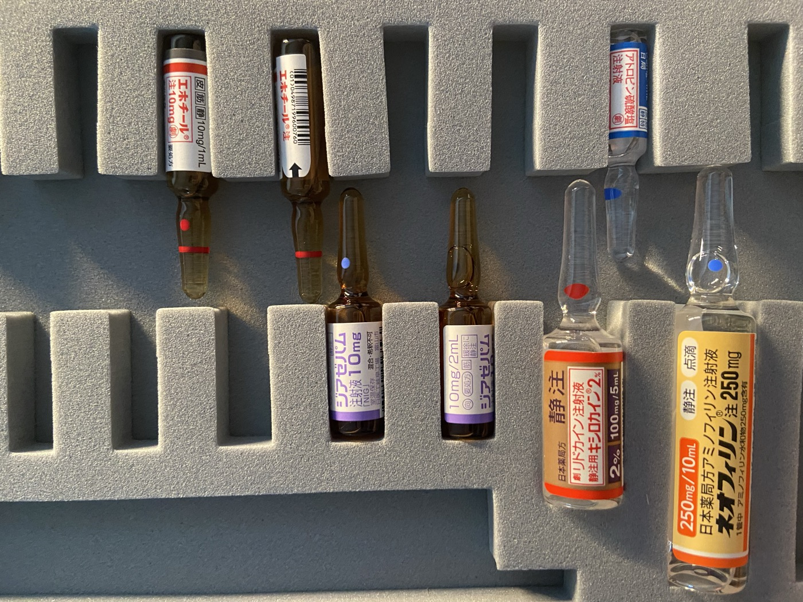
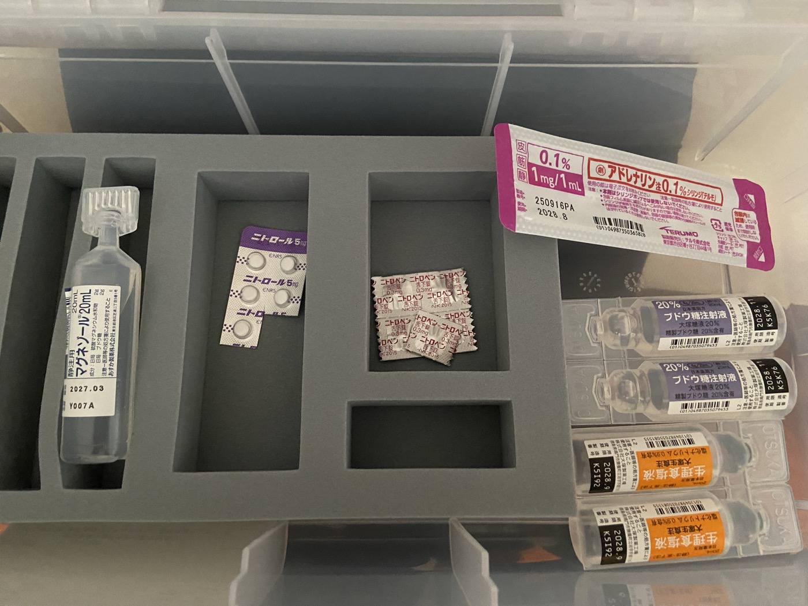
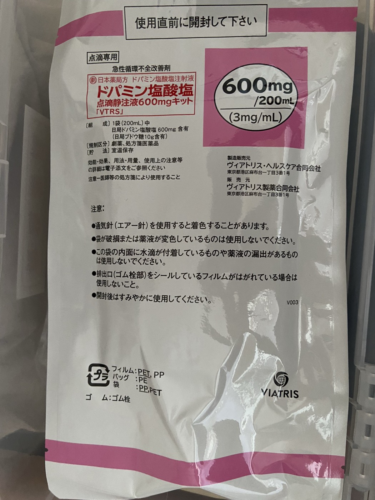

# 救急セット

急変時に使用する薬剤・器材の一覧と保管場所。**[緊急時対応](./01-emergency.html)と併せて確認すること。**
掲示用の一枚もの → **[救急セット早見表](./03-quick-reference.html)**

> 薬剤の選択・投与量の最終判断は医師が行う。本マニュアルは所在と標準的な用量の目安を示すもので、実際の投与は必ず医師の指示に従い、添付文書（薬剤名のリンク）を確認すること。

## 保管場所

| 区分 | 保管場所 |
|-----|---------|
| 救急薬品ケース | スタッフルームの調剤スペース |
| [デカドロン](https://www.pmda.go.jp/PmdaSearch/iyakuDetail/GeneralList/2454405) | **冷蔵庫**（ケースには入っていない） |
| 点滴セット・留置針・シリンジ | 院内処置スペース |
| [ラクテック（乳酸リンゲル液）](https://www.pmda.go.jp/PmdaSearch/iyakuDetail/GeneralList/3319534)・[生理食塩水（輸液用）](https://www.pmda.go.jp/PmdaSearch/iyakuDetail/GeneralList/3311401) | 院内処置スペース |
| AED | 院内設置場所 |

- 急変時は**ケースごとすぐに持ってくる**
- デカドロンを使う場合は**別途冷蔵庫から持ってくる**

## 救急薬品ケースの中身

### アンプル（トレイ上段）



| 薬剤 | 規格 | 主な適応 | 用量の目安 |
|-----|------|---------|-----------|
| [エホチール注](https://www.pmda.go.jp/PmdaSearch/iyakuDetail/GeneralList/2119401) | 10mg/1mL ×2 | 低血圧・起立性低血圧 | 2〜10mg を皮下・筋注、静注は緩徐に |
| [アトロピン硫酸塩注射液](https://www.pmda.go.jp/PmdaSearch/iyakuDetail/GeneralList/1242405) | 0.5mg/1mL | 徐脈、有機リン中毒 | 徐脈時 0.5mg 静注、必要に応じ反復 |
| [ジアゼパム注射液「NIG」](https://www.pmda.go.jp/PmdaSearch/iyakuDetail/GeneralList/1124402) | 10mg/2mL ×2 | けいれん重積、著明な不穏 | 10mg を **2分以上かけて**緩徐に静注 |
| [静注用キシロカイン注射液2%](https://www.pmda.go.jp/PmdaSearch/iyakuDetail/GeneralList/1214401) | 100mg/5mL | 心室性不整脈 | 50〜100mg を緩徐に静注 |
| [ネオフィリン注（アミノフィリン）](https://www.pmda.go.jp/PmdaSearch/iyakuDetail/GeneralList/2115400) | 250mg/10mL | 気管支喘息発作 | 250mg を希釈し **15〜20分以上**かけて点滴 |

> **ジアゼパム**は呼吸抑制のリスクがあるため、投与中は呼吸・SpO2 を必ずモニタリングする。
> **ネオフィリン**の急速静注は不整脈・けいれんの原因となるため禁止。

### ケース内（錠剤・シリンジ・小容量アンプル）



| 薬剤 | 規格 | 主な適応 | 用量の目安 |
|-----|------|---------|-----------|
| [アドレナリン注0.1%シリンジ「テルモ」](https://www.pmda.go.jp/PmdaSearch/iyakuDetail/GeneralList/2451402) | 1mg/1mL | **アナフィラキシー**、心肺停止 | アナフィラキシー：0.5mg を大腿外側に筋注／CPA：1mg 静注 |
| [ニトロペン舌下錠](https://www.pmda.go.jp/PmdaSearch/iyakuDetail/GeneralList/2171018) | 0.3mg | 狭心症発作 | 1錠を舌下 |
| [ニトロール錠](https://www.pmda.go.jp/PmdaSearch/iyakuDetail/GeneralList/2171016) | 5mg | 狭心症発作 | 1錠を舌下 |
| [静注用マグネゾール（硫酸マグネシウム）](https://www.pmda.go.jp/PmdaSearch/iyakuDetail/GeneralList/1244400) | 20mL | 重症喘息発作、子癇 | 医師の指示により希釈して緩徐に投与 |
| [ブドウ糖注射液20%（大塚糖液20%）](https://www.pmda.go.jp/PmdaSearch/iyakuDetail/GeneralList/3231401) | 20mL ×2 | **低血糖** | 2A（糖 8g）を静注、意識回復を確認 |
| [生理食塩液（大塚生食注）](https://www.pmda.go.jp/PmdaSearch/iyakuDetail/GeneralList/3311401) | 20mL ×2 | 溶解・希釈・ルートフラッシュ | — |

> **アドレナリンはシリンジ製剤**のため、アナフィラキシー時はアンプルカットの手間なく即座に筋注できる。アナフィラキシーではまずこれを取り出す。

### 点滴キット



| 薬剤 | 規格 | 主な適応 | 用量の目安 |
|-----|------|---------|-----------|
| [ドパミン塩酸塩点滴静注液キット「VTRS」](https://www.pmda.go.jp/PmdaSearch/iyakuDetail/GeneralList/2119402) | 600mg/200mL（3mg/mL） | 急性循環不全・ショック | 3〜5μg/kg/分から開始し血圧を見て調節 |

- **使用直前に開封する**（外袋を開けたままにしない）
- 開封後に薬液が着色しているものは使用しない

#### 滴下速度（シリンジポンプなしで投与する場合）

当院にシリンジポンプはないため、**クレンメで滴下数を調節する**。
必ず **60滴/mL の小児用（微量用）輸液セット**を使うこと。20滴/mL の成人用セットでは 50kg・3μg/kg/分 が「60秒に1滴」となり、1滴のずれで投与量が大きく変わるため昇圧の調節に使えない。

**60滴/mL セットでの滴下（○秒に1滴）**

| 体重 | 3μg/kg/分 | 5μg/kg/分 | 10μg/kg/分 |
|-----|----------|----------|-----------|
| 40kg | 25秒に1滴（2.4mL/時） | 15秒に1滴（4.0mL/時） | 7.5秒に1滴 |
| 50kg | **20秒に1滴**（3.0mL/時） | **12秒に1滴**（5.0mL/時） | 6秒に1滴 |
| 60kg | 17秒に1滴（3.6mL/時） | 10秒に1滴（6.0mL/時） | 5秒に1滴 |
| 70kg | 14秒に1滴（4.2mL/時） | 9秒に1滴（7.0mL/時） | 4秒に1滴 |
| 80kg | 13秒に1滴（4.8mL/時） | 8秒に1滴（8.0mL/時） | 3.7秒に1滴 |

表にない体重は次式で計算する（本キットは 3000μg/mL）。

```
mL/時 = (μg/kg/分 × 体重kg) ÷ 50
秒/滴 = 3000 ÷ (μg/kg/分 × 体重kg)    ← 60滴/mL セット
秒/滴 = 9000 ÷ (μg/kg/分 × 体重kg)    ← 20滴/mL セット
```

> 60滴/mL のセットでは「**滴/分 = mL/時**」が一致するため、暗算しやすい。

**重力落下で投与する際の注意**

- 滴下速度は**体位・バッグの高さ・残量・血圧の変化で勝手に変わる**。設定して放置はできない。**5分ごとに血圧と滴下数を数え直す**
- **同一ルートを絶対にフラッシュしない** — ルート内に溜まった薬液が一気に入り、血圧が急上昇する。他剤投与は三方活栓の別ポートから行う
- 可能な限り**単独ルート**とする（他剤の滴下を変えるとドパミンの流量も動くため）
- **血管外漏出で組織壊死**を起こすため、なるべく太い血管を選び、刺入部を継続的に観察する
- ドパミンを開始する状況では**救急要請を行う**（搬送までのつなぎとして使用する）

## 院内に常備している器材・輸液

救急薬品ケースには入っていないが、急変時に必ず使用するもの。

- **点滴セット**（ルート一式）
  - **60滴/mL の小児用（微量用）セット** — ドパミンを重力落下で投与する際に必須
- **留置針・注射針・シリンジ**
  - 末梢確保は可能であれば **20G** を使用する
- **三方活栓** — CPA時は薬剤投与に備えて**必ず使用する**
- **[ラクテック（乳酸リンゲル液）](https://www.pmda.go.jp/PmdaSearch/iyakuDetail/GeneralList/3319534)**
- **[生理食塩水（500mL）](https://www.pmda.go.jp/PmdaSearch/iyakuDetail/GeneralList/3311401)**

## 状況別の第一選択

| 状況 | まず取り出すもの |
|-----|----------------|
| アナフィラキシー | アドレナリン注0.1%シリンジ ＋ 生理食塩水・点滴セット |
| 心肺停止（CPA） | AED ＋ アドレナリン ＋ 生理食塩水・点滴セット・三方活栓 |
| 胸痛（狭心症疑い） | ニトロペン舌下錠 |
| 低血糖 | 20%ブドウ糖注射液 |
| けいれん重積 | ジアゼパム注射液 |
| 徐脈 | アトロピン硫酸塩注射液 |
| 喘息発作 | ネオフィリン注 ／ マグネゾール |
| ショック・低血圧 | エホチール注 ／ ドパミン点滴キット |

## 使用期限の管理

- **月1回**、在庫チェックのタイミングで期限を確認する
- 期限切れが近いもの（残り3か月以内）は発注して入れ替える
- **使用したら必ず補充する** — 使用した時点で発注リストに記載する

### 現在の使用期限（確認日：2026年8月）

| 薬剤 | 使用期限 |
|-----|---------|
| 静注用マグネゾール | 2027.03 |
| アドレナリン注0.1%シリンジ | 2028.08 |
| 生理食塩液（大塚生食注） | 2028.09 |
| ブドウ糖注射液20% | 2028.11 |
| エホチール注 | 要確認 |
| アトロピン硫酸塩注射液 | 要確認 |
| ジアゼパム注射液 | 要確認 |
| 静注用キシロカイン注射液2% | 要確認 |
| ネオフィリン注 | 要確認 |
| ニトロペン舌下錠 | 要確認 |
| ニトロール錠 | 要確認 |
| ドパミン点滴静注液キット | 要確認 |

## 使用後の対応

1. 使用した薬剤名・投与量・投与時刻を**時系列で記録**する
2. アンプル・シリンジの空容器は**記録が終わるまで破棄しない**（用量確認のため）
3. 使用分を**発注リストに追加**し、補充後にケースの定位置へ戻す
4. ケースの中身が定数どおりか確認してから収納する
